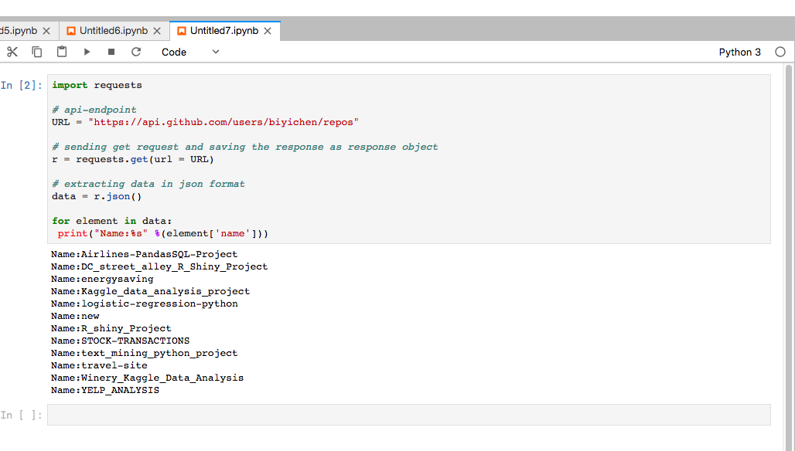

# BiyiChen_REST_API
#### I used python IDLE and Anaconda Notebook to to return the list of public repositories accessible to my user account. First I need to installed the requests package in the both Anaconda and IDLE. 

```
pip install requests
```
#### After you installed the requests package in your python, import the requests packge in either IDLE or Anaconda Notebook (I posted both file on this Repositority, you might need the high speeh internet to review the ipynb therefore, I also posted the py file on this Repositority). 
```
import requests 
```
#### Given the api-endpoint 
```
URL = "https://api.github.com/users/biyichen/repos"
```
#### Sending get request and saving the response as response object
```
r = requests.get(url = URL) 
```
#### Extracting data in json format and only print the name of the user account
```
data = r.json() 
  
for element in data:
 print("Name:%s" %(element['name']))
```
#### The following is the screenshot that I took in the notebook in case you might not be able to open the ipynb file.

