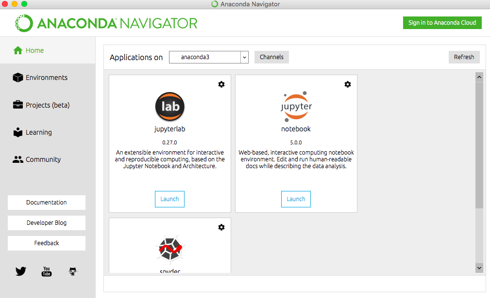

# BiyiChen_REST_API
#### I used python IDLE and Anaconda Notebook to to return the list of public repositories accessible to my user account. 

## Installation 
#### Anaconda Notebook
#### If you used Anaconda Notebook, which is my favorite one. Here is the resource to download.
(https://jupyter.readthedocs.io/en/latest/install.html#installing-jupyter-using-anaconda-and-conda)
#### Once you finished the download, open the Anaconda and click the jupyter notebook. You can clone the script in your desktop and open the ipynb file in the jupyter notebook. Or you can use the code that I wrote in the following lines into a new script jupyter notebook file to test the code. The view should look like the picture below when you open the Anaconda:


#### IDLE 3.6
#### Here is the link for downloading the IDLE 3.6.
(https://www.python.org/downloads/)


## Requests Package install in Python

#### First I need to installed the requests package in the both Anaconda and IDLE in your terminal if you use Mac. 

```
pip install requests
```
For Windows user intsall the requests package in python
```
python -m pip install requests
```

#### After you installed the requests package in your python, import the requests packge in either IDLE or Anaconda Notebook (I posted both file on this Repository, you might need the high speeh internet to review the ipynb therefore, I also posted the py file on this Repository). 
```
import requests 
```
#### Given the api-endpoint 
```
URL = "https://api.github.com/users/biyichen/repos"
```
#### Sending get request and saving the response as response object
```
r = requests.get(url = URL) 
```
#### Extracting data in json format and only print the name of public repositories in the user account
```
data = r.json() 
  
for element in data:
 print("Name:%s" %(element['name']))
```
#### The following is the screenshot that I took in the notebook in case you might not be able to open the ipynb file.

